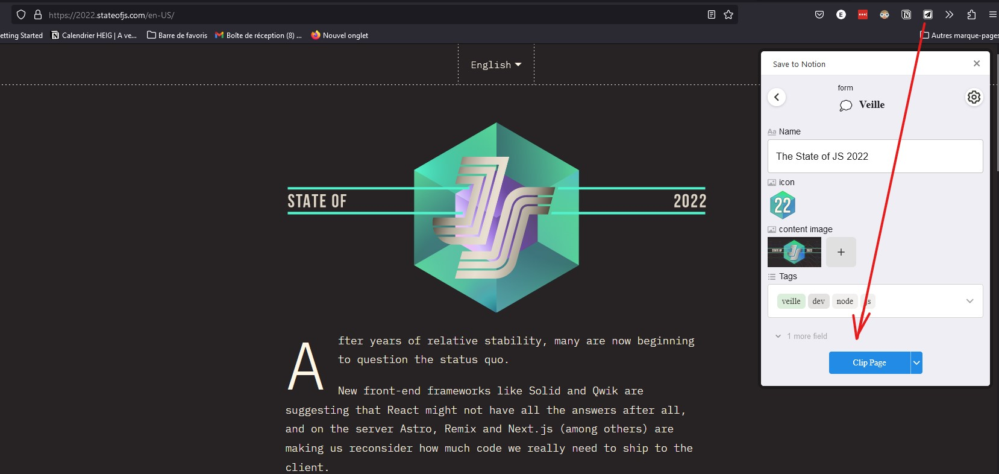
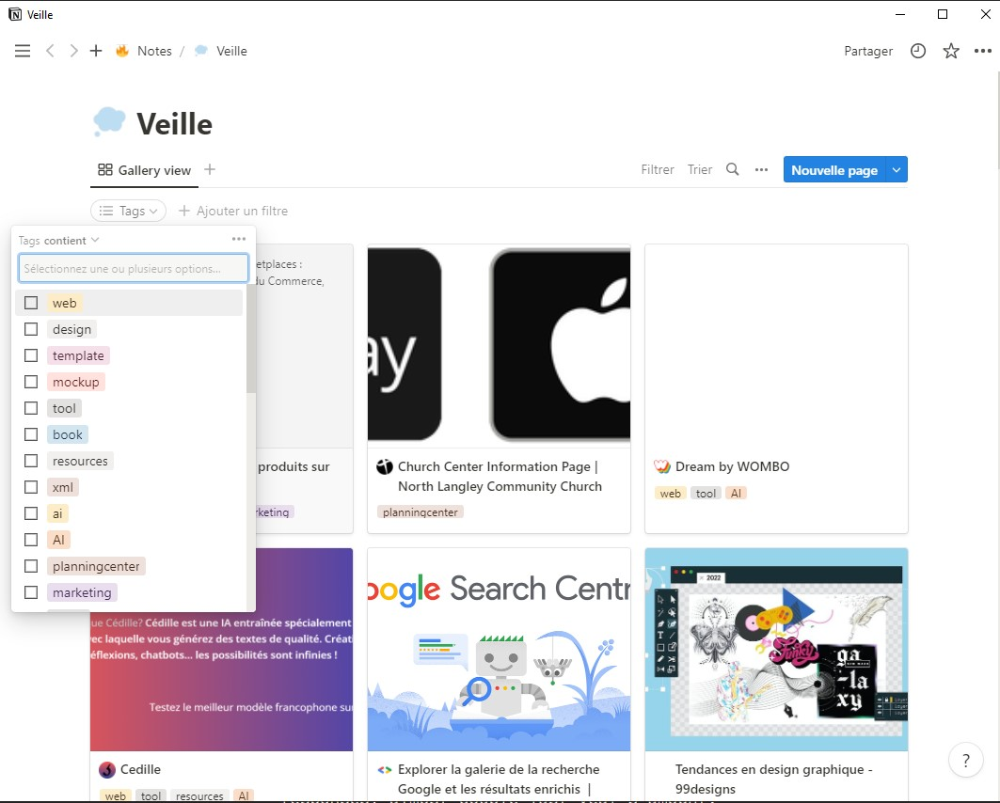

# L'importance de la veille
Il est important pour moi de rester à jour dans mon domaine qu’est le développement web. Chaque jour de nouvelles avancées technologiques et de nouvelles méthodes de développement sont publiés sur le web. Avec le monde en constante évolution et rapide de la technologie, il peut être difficile de suivre, mais avec les bonnes sources, cela peut être rendu plus facile.
Dans cet article, je partage mes sources préférées pour rester à jour sur les dernières nouveautés en développement web. Pourquoi dans ce domaine en particulier ? Va voir ma page « à propos » pour en savoir plus.

# Les sources principales de ma veille
## Reddit

Ce forum en ligne populaire fournit une multitude d'informations et de discussions sur une large gamme de sujets, y compris le développement web. Avec des subreddits dédiés tels que /r/webdev, /r/learnprogramming et /r/javascript, je compte m’informer environ 3 fois par semaine, simplement en me rendant sur ma page d’actualités et en défilant les informations. Je sauvegarderai toutes les publications qui me paraissent pertinentes. En plus de les sauvegarder sur Reddit, je les enregistrerai sur mon Notion.

## BDM
Le Blog du Modérateur:
Ce blog est une excellente ressource pour rester à jour avec les dernières nouvelles, tendances et meilleures pratiques en développement web. Écrit par des développeurs expérimentés et des experts dans le domaine, il offre une richesse d'informations et des conseils pratiques pour améliorer vos compétences et rester à jour.
Je suis abonné à leur newsletter hebdomadaire. Tous les vendredis, je lis les titres, consulte les articles qui m'intéressent, puis sauvegarde pour plus tard ceux qui sont vraiment intéressants et utiles.

## Github

En tant que développeur web, Github est un outil essentiel pour partager, collaborer et apprendre auprès d'autres développeurs. En plus de ses nombreuses ressources pour les développeurs, Github a également un blog, présentant des articles de développeurs expérimentés, des tutoriels, et plus encore. Avec des profils d'auteur, tels que [jlord]), je compte m'informer et rester à jour sur ce qui se passe sur la toile.

## Youtube
Sur Youtube également je trouve des informations pertinentes.
Dans la liste je peux citer notamment: 
- [Benjamin Code](https://www.youtube.com/@BenjaminCode) : Développeur web, qui fournit du travail de qualité
- [Underscore](https://www.youtube.com/channel/UCWedHS9qKebauVIK2J7383g) : Chaîne Youtube avec des invités de qualité, qui parlent de technologies diverses, axé principalement sur le développement.
- ...

# « Garder pour plus tard »
Il est facile de copier le lien d'un site web dans une liste à puce interminable d'autres lien sur Google Keep ou sur Evernote.
Ou alors mettre dans la barre des favoris Firefox le lien qui nous parle. 

Mais comment retrouver le site qu'on a gardé il y a 6 mois en arrière, et qu'on a besoin maintenant ? Pas facile, avec tous ces favoris... 

## Notion
J'ai eu l'occasion durant mon Bachelor de découvrir Notion : une application de prise de note très complète.
Chaque article intéressant, je le sauvegarde dans une "base de données" Notion, en lui donnant des tags spécifiques et pertinents. 

En plus de ça, Notion a un plugin "Notion saver". Il permet d'enregistrer une page web directement dans notion, et je peux choisir les tags que je veux avant de le sauvegarder.

Je peux ensuite facilement retrouver ce qu'il me faut en filtrant par tag dans mon Notion.

## L'importance de la veille
Ce sont là quelques-unes de mes sources préférées pour rester à jour sur les dernières nouveautés en développement web. Des forums en ligne aux blogs d'experts, il existe de nombreuses ressources pour vous aider à rester à jour et à améliorer vos compétences. Que vous soyez débutant ou développeur expérimenté, prendre le temps de rester informé et à jour est essentiel pour rester en avance dans le domaine."