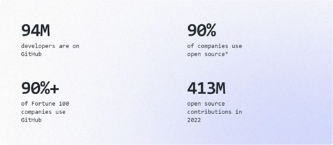

# GitHub
L’Open Source est toujours plus grand : des communautés se créent pour chaque langage et sont réellement actives à la croissance de ces derniers.

Source image: [Octoverse](https://github.blog/2022-11-09-financial-sustainability-in-open-source/?utm_source=github&utm_medium=referral&utm_campaign=&scid=&utm_content=octoverse)

Etant développeur web, j'ai voulu me renseigner sur GitHub, les communautés et le monde de l'open source.

GitHub a joué un rôle important dans le monde de l'Open Source en permettant à des développeurs du monde entier de collaborer et de contribuer à des projets communs.
Malgré la grande popularité de l'Open Source, la plupart des personnes qui y participent le font de manière bénévole. 

Cependant, cela peut être épuisant pour ces bénévoles de continuer à travailler sur ces projets sans rémunération. Pour remédier à cela, GitHub a lancé GitHub Sponsor en 2019, permettant aux utilisateurs de soutenir financièrement les développeurs dont les projets les intéressent. 

Les développeurs peuvent s'inscrire pour être sponsorisés et leurs informations bancaires sont alors disponibles pour les utilisateurs souhaitant les soutenir financièrement.

Cela offre un moyen pour les entreprises d'appuyer les projets Open Source qu'elles utilisent fréquemment. Enfin, cela permet également de rendre l'Open Source plus viable et durable en soutenant les personnes qui y participent.

Cette fonctionnalité est en place depuis déjà quelques années (2019), mais ce n’est qu’aujourd’hui que j’en ai entendu parler.

En tant que développeur, c’est intéressant de connaître cette information. Premièrement, si un jour je me met à créer des librairies utiles à d’autres développeurs, je serai content de savoir que je pourrai obtenir un soutien financier pour mon travail. N’ayant pas l’intention de développer cela, mon intérêt sera plutôt de savoir qu’en tant qu’entreprise, nous pourrons soutenir les auteurs·trices de librairies que nous utiliserons souvent. 

# Sources
Sources : 
- [Blog du modérateur](https://www.blogdumoderateur.com/)
- [Github octoverse](https://octoverse.github.com/)
- Reddit.