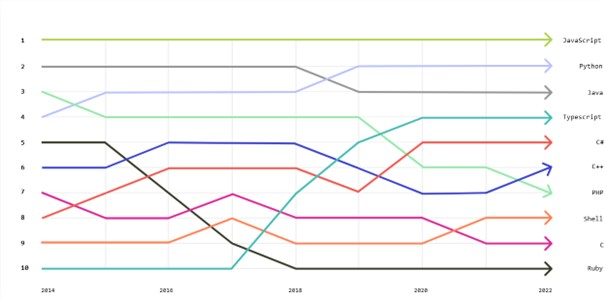

# Introduction
En tant que développeur, il est important de connaître l'état actuel de JavaScript et des frameworks qui s'y rattachent. Les nouvelles technologies et les mises à jour apportées aux frameworks peuvent influencer notre choix lors du développement de nouvelles applications, ce qui peut avoir un impact sur la qualité du produit final.

# Javascript

JavaScript est un langage de programmation qui a énormément évolué au fil des années. Il est le langage de développement le plus populaire, utilisé pour la création d'applications web. 

[Source de l'image](https://octoverse.github.com/2022/top-programming-languages)

La popularité de JavaScript est due à sa simplicité, sa souplesse et sa capacité à être exécuté sur toutes les plateformes web. Ce qui en fait aussi sa faiblesse, est sa liberté d'écriture. Les variables n'ont pas besoin d'être typées.

Cependant, la complexité des applications web modernes a entraîné la création de frameworks pour aider les développeurs à mieux gérer leur code JavaScript. Ces frameworks offrent des fonctionnalités supplémentaires et une structure pour les applications, ce qui en facilite le développement et l'entretien.

## Les frameworks JavaScript les plus populaires

Il existe de nombreux frameworks JavaScript populaires, tels que React, Vue.js et Angular. Chacun d'entre eux propose une approche différente pour la création d'applications web, mais tous ont un but commun : rendre le développement plus facile et plus efficace.

React est l'un des frameworks JavaScript les plus populaires, utilisé pour la création de composants réactifs pour les applications web. 

Vue.js, quant à lui, est un framework progressif qui se concentre sur la facilité d'utilisation et la flexibilité. 
C'est celui que j'ai le plus utilisé durant ma formation. La prise en main prend un peu de temps, mais il est ensuite rapide à utiliser.

Angular est un framework complet pour les applications web, offrant une gamme complète de fonctionnalités pour la création de solutions robustes et fiables.

VueJS et Angular permettent de réaliser des SPA (Single Page Application) facilement. React, quant à lui est beaucoup plus complet que les deux autres, et il s'agit d'ailleurs de la librairie préférée des développeurs selon [browserstack](https://www.browserstack.com/guide/angular-vs-react-vs-vue).

Je pense que les trois sont intéressants et que le choix d'utilisation dépend du projet à réaliser. Un gros projet sera plus robuste en utilisant react par exemple.

# Important pour le futur
Il est important de savoir ce qui est à la mode et ce qui est en déclin, afin de ne pas perdre de temps sur des technologies obsolètes ou sur le point d'être abandonnées. En l'occurence, ces trois frameworks / librairies mentionnées ne sont pas encore en déclin, mais il est important de les garder à l'oeil et de regarder toutes les autres technologies qui sont en développement.

# Sources
- [solguruz - future of js](https://solguruz.com/blog/future-of-javascript/)
- [solguruz - top js frameworks](https://solguruz.com/blog/top-javascript-frameworks/) 
- [tier-list librairies - stateofjs](https://2022.stateofjs.com/en-US/libraries/#tier_list)