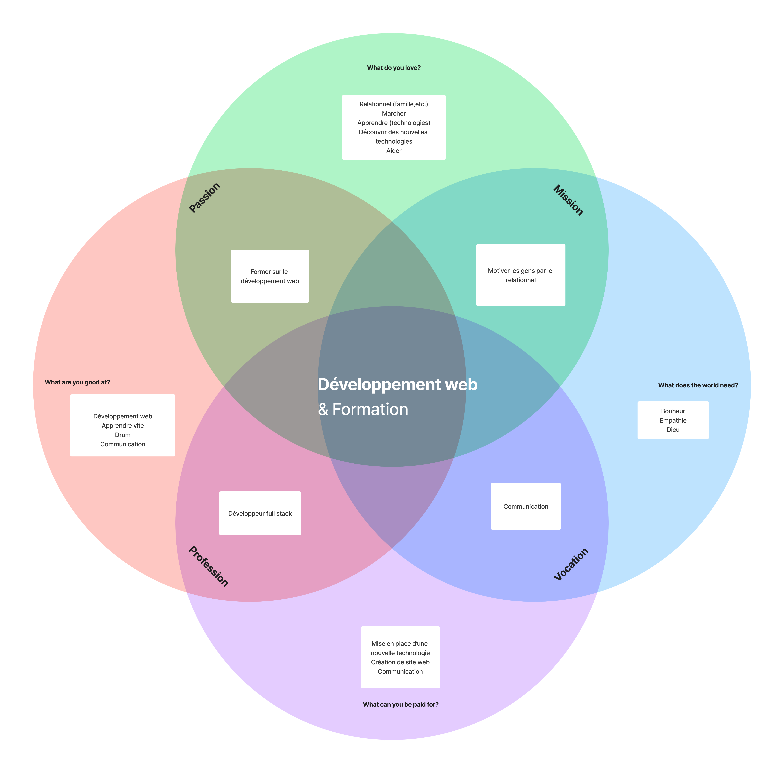

## Développeur Web
Je m'appelle Emile Vianney-Liaud et je suis développeur Web. Ce site réalisé avec [Hugo](https://gohugo.io/) te donnera un aperçu de qui je suis et des réflexions / recherches que j'ai faites.

#### Mots-clés
Durant notre cours de veille technologique, j'ai eu l'occasion de réfléchir à ce qui me motive réellement. Un premier exercice était de noter les éléments dans lesquels nous nous voyions, en allant toujours plus dans le détail. 

| **Domaine** | Développeur full-stack |
|---|---|
| **Mots-clés** | Contenu, expérience, web, développement, interaction, UX, framework, technologies web, UI, langages de programmation, CSS, javascript, formation |
| **Sous-domaines** | Front-end, back-end, gestion BDD, interactive design, cms, crm |
| **Pourquoi ?** | Permettre à chacun d'accéder à du contenu de qualité. Former des gens au travers de sites interactifs et ludiques. |

#### Ikigai
La réflexion avec les mots-clés ci-dessus m'a aidé dans la réalisation de mon [Ikigai](https://fr.wikipedia.org/wiki/Ikigai). C'est un résumé de ce à quoi j'aspire dans différents domaines. Le voici ci-dessous.

Au travers de ces deux principales réflexions, j'ai fait une veille et j'ai rédigé plusieurs articles dans des domaines qui m'intéressent. N'hésite pas à aller voir mes articles !

#### LinkedIn
N'hésite pas à connecter avec moi sur [LinkedIn](https://www.linkedin.com/in/vianney-liaud-emile/).

